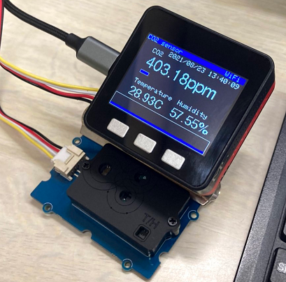

# M5Stack_scd30_CO2_sensor

## M5Stack で CO2センサーのSCD30 を動かすコードを作ってみました。


- CO2濃度を表示します
- 温度を表示します
- 湿度を表示します
- CO2の値をバー表示
   - バーの色は1,000ppm以下で青色
   - 2,500ppm以下で黄色
   - 2500ppmを超えると赤色になります。
- WiFi接続でNTP使って時計表示
- WiFi接続でAmbientへアップロードします。

## 動かし方
- SCD30をM5Stackへつなぎ電源を入れるだけです。
- ボタンの説明
  - 左ボタン（Aボタン）：画面を明るくする（初期状態）
  - 中央ボタン（Bボタン）：画面を暗くする
  - 右ボタン（Cボタン）：WiFiへの再接続

## コンパイル方法
- 環境は Visual Studio Code + PlatformIO IDE
- WiFi接続設定と，Ambientの接続設定が必要
  - これらをWiFiConnect.h ファイルに書き込みます。
include フォルダの中に WiFiConnect.h ファイルを新規作成してください。

- WiFiConnect.h の例
```cpp
void WiFiConeect(WiFiMulti& wifiMulti)
{
	wifiMulti.addAP("SSID1", "PASS1");
	wifiMulti.addAP("SSID2", "PASS2");
}
unsigned int channelId = 0000; // AmbientのチャネルID
const char* writeKey = "XXXXXX"; // ライトキー
```

## Ambient側のチャンネル設定のグラフ項目の値と単位
- データー1
  - CO2(ppm)
- データー2
  - 温度(℃)
- データー3
  - 湿度(%)
